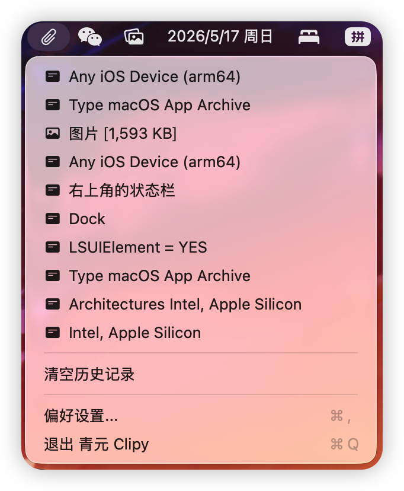
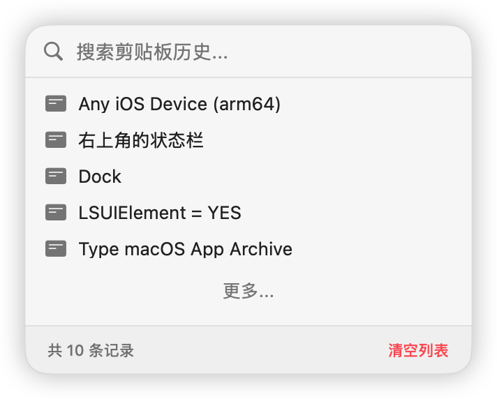

  

# 青元 Clipy

​        **青元 Clipy** 是一款为 macOS 设计的轻量级剪贴板管理工具。它能够隐式地记录你的剪贴板历史，并通过快捷键快速唤出弹窗进行查看和极速粘贴。

## ✨ 特性 (Features)

- **剪贴板监听**: 后台自动监听并保存剪贴板历史记录。
- **全局快捷键**: 支持通过自定义全局快捷键快速呼出剪贴板历史菜单。
- **弹窗交互**: 原生且快速的 macOS 浮窗交互体验 (基于 SwiftUI)。
- **快捷粘贴**: 选择历史记录后可快速在当前焦点应用中执行粘贴操作。
- **配置与设置**: 提供简单易用的设置界面。

## 📷 预览 (Preview)

  

  

## ⚙️ 系统要求 (System Requirements)

- **macOS 26.0** 或更高版本。

## 🚀 安装 (Installation)

### 下载最新版本 (推荐)
1. 前往项目的 [Releases 页面](https://github.com/Haodong-LL/QingyuanClipy/releases) 下载最新版本的 `.dmg` 文件。
2. 双击打开下载的 `.dmg` 文件。
3. 将 **青元 Clipy** 图标拖拽到右侧的 `Applications (应用程序)` 文件夹中即可完成安装。

## ⚙️ 权限设置

为了使 QingyuanClipy 能够正常监听并在其他应用中自动执行粘贴操作，请确保赋予其**辅助功能 (Accessibility)** 权限：
1. 打开 macOS 的 **系统设置 > 隐私与安全性 > 辅助功能**。
2. 找到 QingyuanClipy 并将其开关打开（如未找到可点击 "+" 手动添加应用）。

## 🤝 贡献 (Contributing)

欢迎提交 Issue 和 Pull Request！
1. Fork 本仓库
2. 创建你的特性分支 (`git checkout -b feature/AmazingFeature`)
3. 提交你的更改 (`git commit -m 'Add some AmazingFeature'`)
4. 推送到分支 (`git push origin feature/AmazingFeature`)
5. 开启一个 Pull Request

## 📄 许可证 (License)

本项目基于 [MIT License](LICENSE) 开源。
